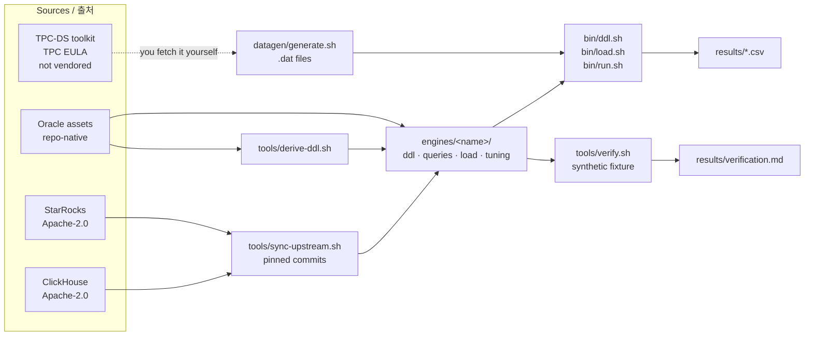

# tpcds-scripts

TPC-DS derived schemas, queries and runner scripts for **Oracle, PostgreSQL, Vertica,
ClickHouse and StarRocks** — one common set of commands, per-file provenance, and a
verification harness you can run yourself.

**Oracle, PostgreSQL, Vertica, ClickHouse, StarRocks** 를 위한 TPC-DS 파생 스키마·쿼리·
실행 스크립트. 공통 명령 세트, 파일별 출처 표기, 직접 실행할 수 있는 검증 하네스를
제공합니다.

[Quick start / 빠른 시작](getting-started/quickstart.md){ .md-button .md-button--primary }
[Verification / 검증](verification/index.md){ .md-button }
[GitHub](https://github.com/litkhai/tpcds-scripts){ .md-button }

!!! warning "Warning / 주의"

    Results measured with these scripts are **not** TPC-DS results and are **not**
    comparable to published TPC-DS results. See
    [Methodology & fair use](reference/methodology.md).

    이 스크립트로 측정한 값은 TPC-DS 결과가 **아니며** 공표된 TPC-DS 결과와 비교할 수
    **없습니다**. [측정 방법론 및 fair use](reference/methodology.md) 참고.

<div class="card-grid" markdown>

[<strong>Engines →</strong><span>Per-engine setup, dialect notes and known caveats for all five.<br>엔진 5종의 설정·방언 특징·주의 사항.</span>](engines/index.md)

[<strong>Verification →</strong><span>One command per engine: schema, load, all 103 queries.<br>엔진당 한 명령으로 스키마·적재·103개 쿼리 검증.</span>](verification/index.md)

[<strong>TPC-DS schema →</strong><span>The 24 tables, the star layout, and row counts per scale factor.<br>24개 테이블, 스타 구조, 스케일 팩터별 행 수.</span>](reference/schema.md)

[<strong>Licensing →</strong><span>What TPC owns, what this repo owns, and what you may publish.<br>TPC 소유·리포 소유 범위와 공개 가능 범위.</span>](reference/licensing.md)

</div>

## What this is / 개요

One place to stand up the TPC-DS workload on five databases and run it the same way on
each. For every engine: the schema, the full 103-query set in that engine's dialect, a
loader using that engine's native bulk tool, and tuning scripts.

다섯 개 데이터베이스에 TPC-DS 워크로드를 구성하고 동일한 방식으로 실행하기 위한
저장소입니다. 각 엔진에 대해 스키마, 해당 엔진 방언의 103개 쿼리 전체 세트, 엔진 고유
벌크 도구를 사용하는 로더, 튜닝 스크립트를 제공합니다.

Two things this repository takes seriously:

이 저장소가 특히 중요하게 다루는 두 가지:

1. **Provenance.** Every SQL file names the upstream repository it came from, the pinned
   commit, the licence, and exactly what was changed. `tools/sync-upstream.sh`
   regenerates all 515 of them, so provenance is checkable rather than claimed.
   **출처.** 모든 SQL 파일에 상류 리포지토리·커밋·라이선스·변경 내용이 명시됩니다.
   `tools/sync-upstream.sh` 가 515개 전체를 재생성하므로 출처는 주장이 아니라 검증
   가능한 상태입니다.
2. **Licensing.** The TPC-DS toolkit is TPC EULA material, not open source, and is never
   vendored here.
   **라이선스.** TPC-DS 툴킷은 오픈소스가 아닌 TPC EULA 자산이며 이 저장소에 포함하지
   않습니다.

## Engine support / 엔진 지원 현황

| Engine / 엔진 | Queries | Loader / 로더 | Docker | Verified / 검증 |
|:---|:-:|:---|:-:|:---|
| [Oracle](engines/oracle.md) | 103 | SQL\*Loader | ✖ | <span class="pill unrun">not run</span> |
| [PostgreSQL](engines/postgres.md) | 103 | `COPY` | ✅ | <span class="pill pass">103/103</span> |
| [Vertica](engines/vertica.md) | 103 | `COPY … DIRECT` | BYO image | <span class="pill unrun">not run</span> |
| [ClickHouse](engines/clickhouse.md) | 103 | `INSERT … FORMAT CSV` | ✅ | <span class="pill partial">100/103</span> |
| [StarRocks](engines/starrocks.md) | 103 | Stream Load | ✅ | <span class="pill pass">103/103</span> |

103 = the 99 TPC-DS queries, where 14, 23, 24 and 39 each have two formulations.

103 = TPC-DS 99개 쿼리 기준, 14·23·24·39 는 각각 두 가지 정식화를 가집니다.

Oracle and Vertica are unverified because neither has an anonymously pullable container
image — not because anything is known to be wrong. See
[Verification](verification/index.md).

Oracle 과 Vertica 가 미검증인 이유는 문제가 발견되었기 때문이 아니라, 익명으로 받을 수
있는 컨테이너 이미지가 없기 때문입니다. [검증](verification/index.md) 참고.

## How it fits together / 전체 흐름



## Repository layout / 저장소 구조

```text
tpcds-scripts/
├── bin/                    ddl.sh · load.sh · run.sh · lib/common.sh
├── engines/<name>/         ddl · queries (103) · load · tuning
├── datagen/                fetch-toolkit.sh · generate.sh
├── docker/                 one compose profile per engine
├── config/                 *.env.example
├── tools/                  sync-upstream · derive-ddl · verify · make-fixture · compare-schemas
├── docs/                   this site / 이 사이트
├── results/                run output, git-ignored / 실행 결과, git 제외
├── LICENSE                 Apache-2.0, this repo's own code
└── NOTICE.md               provenance and TPC licensing / 출처 및 TPC 라이선스
```

## Licensing / 라이선스

!!! licence "Licensing / 라이선스"

    This project's own scripts are Apache-2.0. The TPC-DS schema and query text are
    derived from a TPC benchmark specification and remain subject to TPC's rights; the
    data generator is TPC EULA material and is not included here. Anything you measure
    is "TPC-DS derived" and must not be presented as a TPC-DS result.

    이 프로젝트 고유 스크립트는 Apache-2.0 입니다. TPC-DS 스키마와 쿼리 원문은 TPC
    벤치마크 규격에서 파생된 것으로 TPC 의 권리가 유지됩니다. 데이터 생성기는 TPC EULA
    자산이며 여기에 포함되지 않습니다. 측정한 값은 "TPC-DS 파생" 이며 TPC-DS 결과로
    제시해서는 안 됩니다.

Full detail, including per-file provenance and the sources that were deliberately
rejected, is in [Licensing](reference/licensing.md) and
[`NOTICE.md`](https://github.com/litkhai/tpcds-scripts/blob/master/NOTICE.md).

파일별 출처와 의도적으로 배제한 소스를 포함한 상세 내용은
[라이선스](reference/licensing.md) 와
[`NOTICE.md`](https://github.com/litkhai/tpcds-scripts/blob/master/NOTICE.md) 에 있습니다.
