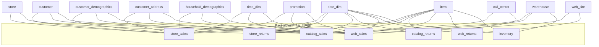

# TPC-DS schema / TPC-DS 스키마

TPC-DS models a retailer selling through three channels — store, catalog and web — as a
set of connected star schemas. 24 tables are loaded: 7 fact tables and 17 dimensions.

TPC-DS 는 매장·카탈로그·웹 세 채널로 판매하는 소매업체를 여러 개의 연결된 스타 스키마로
모델링합니다. 적재되는 테이블은 24개로, 팩트 테이블 7개와 차원 테이블 17개입니다.

## Shape / 구조

Each channel has a sales fact and a returns fact, and they share the dimensions.
`inventory` is the seventh fact table, tying items to warehouses over time.

각 채널은 판매 팩트와 반품 팩트를 가지며 차원을 공유합니다. `inventory` 가 일곱 번째 팩트
테이블로, 시간에 따라 상품과 창고를 연결합니다.



## Tables / 테이블

### Fact tables / 팩트 테이블

| Table | Grain / 단위 | Primary key / 기본키 |
|:---|:---|:---|
| `store_sales` | one line item per store ticket / 매장 티켓의 라인 아이템 | `(ss_item_sk, ss_ticket_number)` |
| `store_returns` | one returned line item / 반품 라인 아이템 | `(sr_item_sk, sr_ticket_number)` |
| `catalog_sales` | one line item per catalog order / 카탈로그 주문의 라인 아이템 | `(cs_item_sk, cs_order_number)` |
| `catalog_returns` | one returned line item / 반품 라인 아이템 | `(cr_item_sk, cr_order_number)` |
| `web_sales` | one line item per web order / 웹 주문의 라인 아이템 | `(ws_item_sk, ws_order_number)` |
| `web_returns` | one returned line item / 반품 라인 아이템 | `(wr_item_sk, wr_order_number)` |
| `inventory` | item × warehouse × week / 상품 × 창고 × 주 | `(inv_date_sk, inv_item_sk, inv_warehouse_sk)` |

Every fact primary key is composite. That matters when generating test data: drawing the
key columns independently collides within a few thousand rows.

모든 팩트 기본키가 복합키입니다. 테스트 데이터를 생성할 때 중요합니다. 키 컬럼을 독립적으로
뽑으면 수천 행 안에 충돌합니다.

### Dimensions / 차원 테이블

| Table | Notes / 참고 |
|:---|:---|
| `date_dim` | one row per day. `d_month_seq` counts months from 1900-01, so `1200` is January 2000 — several queries use `d_month_seq between 1200 and 1200+11` to mean "year 2000". / 하루당 한 행. `d_month_seq` 는 1900-01 부터의 월 수이므로 `1200` 이 2000년 1월입니다. |
| `time_dim` | one row per second of the day, 86,400 rows / 하루의 각 초마다 한 행, 86,400 행 |
| `item` | scales with SF; slowly changing / SF 에 따라 증가, 완만 변경 차원 |
| `customer`, `customer_address`, `customer_demographics`, `household_demographics` | the customer cluster / 고객 관련 묶음 |
| `store`, `call_center`, `web_site`, `web_page`, `catalog_page` | channel dimensions / 채널 차원 |
| `warehouse`, `ship_mode` | fulfilment / 물류 |
| `promotion`, `reason`, `income_band` | supporting / 보조 |
| `dbgen_version` | written by `dsdgen`, used by no query, not loaded here / `dsdgen` 이 기록하며 어떤 쿼리도 사용하지 않고 여기서는 적재하지 않습니다 |

`dbgen_version` brings the Oracle-derived schemas to 25 `CREATE TABLE` statements; the
ClickHouse and StarRocks schemas omit it and have 24.

`dbgen_version` 때문에 Oracle 파생 스키마는 `CREATE TABLE` 이 25개입니다. ClickHouse 와
StarRocks 스키마는 이를 생략해 24개입니다.

## Load order / 적재 순서

`bin/load.sh` loads dimensions before facts, so a run with enforced referential integrity
also succeeds:

`bin/load.sh` 는 차원을 팩트보다 먼저 적재하므로 참조 정합성을 강제한 경우에도 성공합니다.

```text
call_center  catalog_page  customer_address  customer_demographics  date_dim
household_demographics  income_band  item  promotion  reason  ship_mode  store
time_dim  warehouse  web_page  web_site  customer
  ↓
inventory  store_sales  store_returns  catalog_sales  catalog_returns
web_sales  web_returns
```

`customer` sits last among the dimensions because it references `customer_address`,
`customer_demographics` and `household_demographics`.

`customer` 는 `customer_address`, `customer_demographics`,
`household_demographics` 를 참조하므로 차원 중 마지막에 적재합니다.

## Types / 타입

The specification describes column requirements rather than SQL types, so each engine
maps them:

규격은 SQL 타입이 아니라 컬럼 요구사항을 기술하므로 엔진별로 매핑합니다.

| Spec / 규격 | Oracle · PostgreSQL · Vertica | ClickHouse | StarRocks |
|:---|:---|:---|:---|
| identifier | `integer` | `Int64`, `UInt32` for `*_date_sk` / `*_time_sk` | `integer` |
| integer | `integer` | `Int64` | `integer` |
| decimal(p,s) | `decimal(p,s)` | `Decimal(p,s)` | `decimal(p,s)` |
| char(n) | `char(n)` | `FixedString(n)` | `char(n)` |
| varchar(n) | `varchar(n)` | `String` | `varchar(n)` |
| date | `date` | `Date` | `date` |

Where the schemas disagree on a specific column — and they do, in three places — see
[Schema divergence](../verification/schema-divergence.md).

특정 컬럼에서 스키마가 불일치하는 지점이 세 곳 있습니다.
[스키마 불일치](../verification/schema-divergence.md) 를 참고하십시오.

## Queries / 쿼리

99 queries, of which 14, 23, 24 and 39 each have two formulations, giving **103 query
streams**. Files are named `query01.sql` … `query99.sql`, with `query14_1.sql` /
`query14_2.sql` for the four that have variants.

99개 쿼리이며 14·23·24·39 는 각각 두 가지 정식화를 가져 총 **103개 쿼리 스트림**입니다.
파일명은 `query01.sql` … `query99.sql` 이고, 변형이 있는 네 개는 `query14_1.sql` /
`query14_2.sql` 형식입니다.

The substitution parameters are fixed in these files rather than generated per run by
`dsqgen`. That is one of the reasons results here are not TPC-DS results — see
[Methodology](methodology.md).

이 파일들의 치환 파라미터는 실행마다 `dsqgen` 이 생성하는 것이 아니라 고정되어 있습니다.
여기서의 결과가 TPC-DS 결과가 아닌 이유 중 하나입니다. [방법론](methodology.md) 참고.

!!! warning "Warning / 주의"

    The Oracle query set uses **different** substitution parameters from the other four:
    `query01` filters `s_state = 'SD'` and aggregates `SR_FEE`, where the standard text
    uses `'TN'` and `SR_RETURN_AMT`. Oracle output is therefore not row-for-row
    comparable with the other engines, even at the same scale factor.

    Oracle 쿼리 세트는 나머지 네 개와 **다른** 치환 파라미터를 사용합니다. `query01` 은
    `s_state = 'SD'` 로 필터하고 `SR_FEE` 를 집계하는데 표준 원문은 `'TN'` 과
    `SR_RETURN_AMT` 를 사용합니다. 따라서 동일 스케일 팩터에서도 Oracle 출력은 다른
    엔진과 행 단위로 비교할 수 없습니다.
